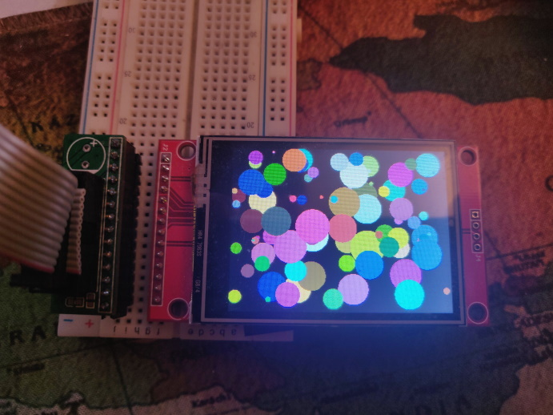

***NEW v1.0: The DC and CS pins can now be choosen to be any digital pin! (but setting DC to a CS capable pin will provide a subtantial speedup) !***

***NEW v1.0: The driver should now work with display that do not have a CS pin.***


# ILI9341_T4

<p align="center">

<a href="https://www.youtube.com/watch?v=lLYCwFRF4Mc" target="_blank"></a></p>


## Optimized ILI9341 screen driver library for Teensy 4/4.1, with vsync and differential updates

This library implements a SPI driver for the ILI9341 screen providing the ability to display memory framebuffers onto the screen very efficiently. 
In particular, the following advanced features are available:

- **Differential redraws.** The driver compares the framebuffer to be uploaded with the previous one and uploads only the pixels that differ. It does so in a smart way to minimize spi transaction / RAWRW commands. Uploading only parts of the screen makes it possible to achieve extremely high frame rates when moderate changes occur between frames (hundreds of FPS for simple cases like UIs). 

- **Asynchronous updates via DMA.** Upload can be performed directly or asynchronously using DMA (even in the case of complicated diff updates) which means that the MCU is free to do other tasks - like generating the next frame - during updates.

- **adjustable framerate.** The screen refresh rate can be adjusted between 40hz and 130Hz and a framerate can be set within the driver. Uploads are then timed to meet the requested framerate.

- **vsync and screen tearing prevention.** This is the best part :-) The driver monitors the position of the current scanline being refreshed on the screen and orders the pixel updates so that they trail behind this scanline. This makes it possible to completely suppress screen tearing provided the update can be done in less than two refresh periods. In most cases, it is possible to reach a solid 45FPS (and more!) without any screen tearing, even with moderate spi speeds. 

- **Multiple buffering methods.** Support direct upload, double buffering and triple buffering configurations. Partial updates with direct or deferred redraw is also possible. 

- **Optimized for use with the LVGL library** Easy to integrate with the <a href="https://github.com/lvgl/lvgl">lvgl library</a>. Blazzingly fast (tear free!) GUI is obtained by using partial differential updates (and without requiring full double buffering - only 200KB of RAM needed).   

- **driver for XPT2046 touchscreen.** Some ILI9341 screens have an associated touchscreen. The driver can also manage this touchscreen on the same spi bus making sure there is no spi conflict.  This simplifies the wiring since only one (or two when using touch interrupt) additional wires are needed to enable touch in that case.  


## Warnings

**(1) This library only works with Teensy 4/4.1 but not with Teensy 3.2/3.5/3.6. You need lots of memory (typically 2 framebuffers and a couple of diff buffers which means around 320Kb of RAM) so it would not be practical to use the library with those other MCUs anyway...**

**(2) The library's only task is to perform framebuffer upload from memory to the screen. It does not provide any drawing primitive. You must use another canvas library to draw directly onto the memory framebuffer. To do so, you can use the <a href="https://github.com/vindar/tgx">tgx</a> library which provides optimized drawing primitives for 2D and 3D graphics on a memory framebuffer.**


## Using the library

### 0. Physical setup / wiring

The library can work with any SPI bus (and mutliples instances of the driver can manage mulitple displays on different spi bus. Yet, a significant speedup is possible when the DC pin from the ILI9341 screen is connected to a CS (chip select) capable pin on the Teensy (yes, this requirement may seems weird at first...). In that case, the library will use the transmit FIFO/DMA to its full capacity and it will provide a nice speed up (around 35% faster framerate) while reducing the busy time (by around 50%). 

**ADVICE: Set DC to a CS capable pin of the Teensy whenever possible (the CS pin from the screen can be connected to any pin on the Teensy, it does not matter...)**

On teensy 4/4.1, one can use either SPI0 or SPI1 (SPI2 might also work but it is not readily accessible). Here are possible wirings in both cases:

ILI9341 SCREEN | TEENSY 4/4.1 (SPI0) | TEENSY 4/4.1 (SPI1) |NOTE
--- | --- | --- | ---
VCC |  | | power from +3.6V to +5.5V
GND |  | | connects to ground, obviously
CS  | PIN 9 | PIN 30 | Optional (but recommended). Any digital pin will do, 255 if not connected
RESET | PIN 6 | PIN29 | Optional (but recommended). Any digital pin will do, 255 if not connected
DC | PIN 10 | PIN 0 |  Mandatory. Any pin will do but choose a CS capable pin whenever possible !
SDI (MOSI) | PIN 11 | PIN 26| Mandatory.
SCK | PIN 13 | PIN27 | Mandatory
LED | | | connect to +3.3V through a small resistor (50 Ohm)
SDO (MISO) | PIN 12 | PIN 1 |  Mandatory

**Remarks**
- If CS = 255, do not forget to connect the CS pin from the display (if present) to GND.
- If RST = 255, do not forget to connect the RST pin from the display to 3.3V 

### 1. Including the library 

As for any arduino library, it should be installed in arduino's `/libraries` subfolder where it will be found automatically. Then, we only need to include the library's main header. 
```
#include <ILI9341_T4.h>
```
Everything in the library is located under the `ILI9341_T4` namespace so the include will not pollute the global namespace.


### 2. Creation of the global objects 

#### (a) Main driver object 

First, we must create a screen driver object and set the pins connected to the display. 
```
ILI9341_T4::ILI9341Driver tft( CS_PIN, DC_PIN, SCK_PIN, MOSI_PIN, MISO_PIN, RST_PIN, TOUCH_CS_PIN, TOUCH_IRQ_PIN); 
```
The `TOUCH_CS` and `TOUCH_IRQ` pin should be specified only if the screen has an associated XPT2046 touchscreen **on the same spi bus as the screen**, otherwise, just omit the last two parameters. 

**Remark.** The `DC_PIN`, `SCK_PIN`, `MOSI_PIN`, `MISO_PIN` are mandatory, the other one can be set to 255. If possible, use a valid CS pin for DC to benefit from hardare speedup. 

#### (b) Memory framebuffers

We need at least one memory frame buffer that we will use to draw onto:
```
uint16_t fb[240*320]; // our memory framebuffer. The screen has size 320 x 240 with color in 16 bits - 565 format
```
Also, if we want to activate double (or triple) buffering, we need one (or two) more frame buffers. For example, to activate triple buffering we should create two more framebuffers:
```
DMAMEM uint16_t fb_internal1[240*320];  // an 'internal' frame buffer for double buffering
DMAMEM uint16_t fb_internal2[240*320];  // and a third for triple buffering (optional)
```
The buffers above have been placed in the upper 512K (dmamem) portion of the memory to preserve the RAM in the faster lower portion (dtcm). The buffers can be placed anywhere in RAM (even in EXTMEM if external ram is present but there will be a huge speed penalty in that case).

**Remark.** Not using any internal framebuffer is possible but, in that case, asynchronous and differential updates will be disabled, thus removing most of the library benefit... Conversely, triple buffering is overkill and usually does not provide any significant improvement over double buffering (while requiring an additional 150KB of RAM). **ADVICE: use double buffering !** 


#### (c) Diff buffers

When the library is working in buffering mode, it can take advantage of the fact that the last internal buffer uploaded to the screen mirrors the screen content. Therefore, when a new framebuffer is to be uploaded, the library can check which pixels have changed and only upload those. This provides a huge speed bump when only a fraction of pixels changes at each frame (which is common when displaying user interface for instance). The library is said to use **differential updates** in that case. When performing differential updates, the library first creates a **diff log** of all changes between the new framebuffer and the previous one. Once this is accomplished, it can overwrite the internal frame buffer containing the last frame with the new one and, when an update is needed, just read the diff to select the pixels that must be pushed onto the screen. Update can be carried away asynchronously while the user code draws the next frame. 

So, in order to store the diff log, we must allocate some memory for a **diff buffer** which is an object that stores diff logs:
```
ILI9341_T4::DiffBuffStatic<4096> diff1; // a first diff buffer with 4K memory (statically allocated)
ILI9341_T4::DiffBuffStatic<4096> diff2; // and a second one. 
```
The template parameter above specifies the size (in bytes) of the buffer. It should range from 1K to 10K depending on the kind of content displayed. The method `diff1.printStats()` can be used to check the diff buffer memory consumption and adjust its size accordingly.

**Remark.** Two diff buffer are useful even when using double (and not triple buffering) and we provide a nive pseed boost: **ADVICE: always use two diff buffers**.

### 3. Initialization and configuration. 

#### (a) Initialization
The constructor of the main ILI9341Driver object `tft` does not initialize anything. We must do that when ready by calling the ubiquitous arduino `begin()` method (usually within `setup()`) like so:
```
void setup()
  {
  ...
  if (!tft.begin(SPI_WRITE_SPEED, SPI_READ_SPEED))
      Serial.print("ouch !")
  ...
```
This method returns `true` if the screen was correctly initialized. Note that there is no corresponding `end()` method so `begin()` should normally be called only once (but it can still be called again to issue a hard reset). The SPI_WRITE_SPEED and SPI_READ_SPEED parameters can be omitted so default speeds for write/read spi will be used. The spi read speed does not really matter and should not be changed. On the other hand, the maximum possible framerate is proportional to the spi write speed so it should be set as high as possible while still keeping a stable connexion. With short wires, many displays will easily accept speeds upward of 60Mhz...

#### (b) Choosing the screen orientation 

There are 4 possible orientations for the display (matching, of course, to the four physical orientations). Each one is obtained from the previous one by rotating the screen 90 degrees clockwise. Orientation 0 and 2 are in portrait mode 240x320 whereas orientation 1 and 3 are in landscape mode 320x240. In all cases, the framebuffer layout is in row-major format: if the screen has size LX x LY, then 

Pixel(i , j) = framebuffer[ LX * j  + i]  with 0 <= i < LX and 0 <= j < LY. 

The "natural" orientation is `orientation=0` for which the pixels in the framebuffer are ordered the same way that they are refreshed on the screen. This orientation will give the best possible upload rate and should be preferred.

To set the screen orientation, use the method `setRotation()`:
```
tft.setRotation(0); // use the most efficient orientation (portrait mode)
```

#### (c) Setting up buffering mode
We just register one (or two) internal framebuffers like so:
```
tft.setFramebuffers(fb_internal1, fb_internal2); // registering 2 framebuffers. This activates triple buffering
```
Buffering mode is automatically adjusted according to the number of internal framebuffers. The method can be called again to change the buffering mode on the fly and add/remove framebuffers. In particular, calling it without any argument `tft.setFramebuffers()` will disable buffering and activate the (inefficient) synchronous upload mode.

#### (d) Setting up differential redraws

To enable differential updates, we must register the diff buffers just like we registered the framebuffers above:
```
tft.setDiffBuffers(&diff1, &diff2); // registering 2 diff buffers. This activates differential update mode
```
Note that, when using direct (non-buffered) mode, differential updates cannot be performed so registered diff buffers are simply ignored. When using double buffering, differential updates are enabled as soon as there is at least one diff buffer registered but registering a second one will give better performance for only a small additional RAM cost. When using triple buffering, two diff buffers are mandatory: if only one is set then diff updates will be disabled (and you do not want that!). 

#### (e) Setting the refreshrate and the framerate

The **refreshrate** is the number of times per second that the display redraws the pixels on the screen. Each screen refresh starts from the top-left corner and progresses along horizontal lines toward the bottom-right corner (with the display held in 240x320 portrait orientation mode 0). The row of pixels currently being refreshed is referred to as the **scanline**.  

The **framerate** on the other hand is the number of times the screen content is actually updated by the driver every second. When pixel upload and pixel refresh are not synchronized, we end up with the screen displaying part of the old and the new frame simultaneously which create a visual defect called **screen tearing**. 

In order to prevent this, the driver keeps track of the refresh times and tries to upload pixels trailing behind the scanline. However, if the upload rate is much slower than the refresh rate, then the scanline will still eventually catch up with the pixels being uploaded and screen tearing will occur. In order to get prevent visual artifact and insure a stable framerate, the following two conditions must be met:

[1] The time to upload a whole frame must take no longer than 2 refresh periods. 

[2] The frame rate must divide the refresh rate (ie framerate=refreshrate/N for some positive integer N). 

The first condition depends heavily on the SPI speed. For example, with SPI set at 60Mhz, it is possible to upload up to 45 full frames per second. Being cautious, we can set a refresh rate at 80Hz and a framerate at 40Hz = (80/2) to obtain tear free frames on the screen. However, this computation is a worst case scenario: for most usage, differential updates boost the upload speed tremendously and it is often possible to get "tear free" display at 60Hz frame rate (and 120Hz refresh rate) with only 20Mhz SPI speed !

The refresh rate is set with the `setRefreshRate()` method:
```
tft.setRefreshRate(120); // set the display refresh rate around 120Hz
```
The exact refresh rate varies from display to display. The driver will select the closest refresh rate available for this particular display. The actual refresh rate can subsequently be queried with the `getRefreshRate()` method. 

Now, we must tell the driver the actual framerate/vsync method that we want. This is done with the `tft.setVsyncSpacing()` method. It takes as input a `vsync_spacing` parameter (what a surprise!)  which has the following meaning:

- **`vsync_spacing = -1`**. Do not synchronize display updates with screen refreshes (no vsync).  Each new frame is drawn immediately onto the screen or saved into an internal framebuffer to be drawn asap if there is already an update in progress. If there is currently no free internal framebuffer, the frame is simply dropped... 

- **`vsync_spacing = 0`**. Do not synchronize display updates with screen refreshes (no vsync). Each new frame is drawn immediately onto the screen or saved into an internal framebuffer to be drawn asap if there is already an update in progress. If there is currently no free internal framebuffer, the method waits for a buffer to become available before returning (same as above but no frame is ever dropped). 

- **`vsync_spacing = N > 0`**. Synchronize uploads with screen refreshes to mitigate screen tearing. Perform upload every N screen refreshes so that the actual framerate is equal to framerate=refreshrate/N (provided, of course, that frames are pushed fast enough to the driver to achieve this rate).

In practice, `vsync_spacing=-1` will give the fastest apparent framerate but will usually provide very poor visual quality. Setting `vsync_spacing=-0` will give slightly better results (but still with screen tearing) and still leaves the responsibility to the user of setting a stable framerate by pushing frames at regular intervals... In most cases, the best choice is to set `vsync_spacing = 2` and then adjust the refresh rate so that upload can be performed at refreshrate/2 FPS... Using `vsync_spacing = 1` should be reserved for drawing very simple frames which can be uploaded very quickly onto the screen (in less than a refresh period). Using `vsync_pacing >= 3` can be used to artificially reduce the framerate but I do not know of a really compelling reason to do so. 

So, we select the framerate and vsync mode with:
```
tft.setVSyncSpacing(2); // enable vsync and set framerate = refreshrate/2 (typical choice)
```

That's it, the driver's configuration is now complete and we can start displaying frames !

### 4. Pushing a framebuffer onto the screen.

The method  `update()` is used to push a framebuffer onto the screen:

``
tft.update(fb); // push our memory framebuffer fb to be displayed on the screen
``

What actually happens when the method is called depends on the buffering and vsync mode but, as a general rule, the method will try to return to the caller as soon as possible. It will use its internal framebuffer (if present) to save a copy of fb and return while uploading the frame asynchronously via DMA. So, when the method returns, fb may, or not, already be displayed on the screen but, in any case, **it can be immediately reused for drawing the next frame and changing its content will not affect the display on the screen**.


### 5. Summing it up. 

Putting everything together. A simple code for drawing an animation on the screen should look something like this:
```
#include "ILI9341Driver.h"

// this is the main screen driver object.
ILI9341_T4::ILI9341Driver tft(CS_PIN, DC_PIN, SCK_PIN, MOSI_PIN, MISO_PIN, RST_PIN, TOUCH_CS_PIN, TOUCH_IRQ_PIN); 

uint16_t fb[240*320]; // our memory framebuffer. The screen has size 320 x 240 with color in 16 bits - 565 format.  

DMAMEM uint16_t fb_internal1[240*320];  // an 'internal' frame buffer for double buffering
DMAMEM uint16_t fb_internal2[240*320];  // and a third for triple buffering (overkill)

ILI9341_T4::DiffBuffStatic<4096> diff1; // a first diff buffer with 4K memory (statically allocated)
ILI9341_T4::DiffBuffStatic<4096> diff2; // and a second one (useful even for double buffering)


void draw_something_onto(uint16_t * fb)
  {
  ...
  // here we must add the code that does the drawing on the memory framebuffer. 
  ...
  }


void setup()
  {
  tft.output(&Serial); // info/warning/error messages should be sent to Serial. 
  if (!tft.begin(SPI_WRITE_SPEED, SPI_READ_SPEED))
      Serial.print("ouch !")
      
  tft.setRotation(0); // use the most efficient orientation (portrait mode)
  tft.setFramebuffers(fb_internal1, fb_internal2); // registering 2 framebuffers: this activates triple buffering
  tft.setDiffBuffers(&diff1, &diff2); // registering 2 diff buffers: this activates differential updates
  tft.setRefreshRate(120); // set the display refresh rate around 120Hz
  tft.setVSyncSpacing(2);  // enable vsync and set framerate = refreshrate/2 (typical choice)
  }
    
    
void loop()
  {
  draw_something_onto(fb); // draw the next frame onto fb
  tft.update(fb); // push the framebuffer. That's it !
  }
```

Complete examples can be found in the `/examples` sub-directory of the library. 


## Tips and tricks

- **The `output(&Stream)`**. By default, the driver is silent. To output debug/error message, you can indicate a pointer to the stream object that should be used (for example `Serial`). 
 
- **The `setDiffGap()` method.** When using differential updates, the driver tries to be smart and find a compromise between skipping unchanged pixels but also not fragmenting spi transactions  too much because issuing a re-positioning commands also takes times. To adjust this behaviour, the `setDiffGap()` can be used to specify the number of consecutive unchanged pixels required to break a spi transaction. Typical value should range between 3 and 40. Smaller gaps can provide a speed bump but will require larger diff buffers (possibly up to 10K when using a gap of size 4). It is possible to get statistics on diff buffer memory consumption with the `.printStats()` method applied directly to the diff buffer (not to the tft object). If the diff buffer overflows too often, its size should be increased. 

- **Disabling differential update for a given frame**. Differential updates are beneficial in most cases unless almost all the pixels change in a frame. In this case, there will be no increase in upload speed. Yet, calculating the diff log takes around 1ms of the MCU compute time per frame. When using two diff buffers, this computation is done during async. update so it should not slow down the framerate but it can still be beneficial to skip this computation if you know for sure that the diff will be mostly trivial. You can tell the driver to upload a given frame as is, without computing the diff, by setting the second (facultative) parameter in the update method to true:
```
tft.update(fb, true); // fb will be uploaded without computing the diff (but just for this upload). 
```

- **Printing statistics**. Several methods are available to provide detailed stats about the performance of the driver. All these methods take the form `statsXXX`. Also, there is a very convenient method for debugging/optimization call `printStats()` (same for diff buffers) that will print out all the statistics of the driver onto a given stream (Serial by default). 

- **diff buffer and memory allocation**. The library performs no memory allocation. All the memory needed (framebuffer and diff buffers) are to be provided by the user which keeps complete control over memory allocation. For diff buffers, the `StaticDiffBuffer<>` template class provides a convenient way to create diff buffers with statically allocated memory. However, if more control is needed, one can use the base `DiffBuffer` class which is similar but requires the user to provide the memory space at construction time. See the file `DiffBuff.h` for additional details. 

- **Getting for information, additional methods**. There are several other methods that can be used to fine-tune the driver performance. In particular: `resync()`, `setDiffCompareMask`, `setLateFrameRatio()`... Details about these methods (and more) can be found in the header file [ILI9341Driver.h](https://github.com/vindar/ILI9341_T4/blob/main/src/ILI9341Driver.h). Each method has a detailed docstring above its declaration explaining its purpose.

- **Using the touchscreen**. If a touchscreen is present and connected to the same spi bus, then additional methods become available to read the touch screen status. `lastTouched()` will return the number of milliseconds elapsed since the screen was last touched (only available if the touch_irq pin is set). The `readTouch()` method will return the currently touched position and pressure. Finally, 'calibrateTouch()' provides an interactive method to calibrate the touchscreen and `setTouchCalibration()` can subsequently be used to load calibration data at the beggining of a script.

The wiring for the touchscreen should follow:

ILI9341 SCREEN | TEENSY 4/4.1
--- | --- 
`T_CLK` | same pin on the Teensy as `SCK`
`T_CS` |  any available digital pin
`T_DIN` | same pin on the Teensy as `SDI (MOSI)`
`T_DO` | same pin on the Teensy as `SDO (MISO)`
`T_IRQ` | (optional) any available digital pin


## Credits

- This library was inspired by [Kurte's ILI93451_t3n library](https://github.com/KurtE/ILI9341_t3n) which is where I learned all the 'fun' stuffs about DMA and SPI low level configuration... 

- The code for driving the touchscreen is borrowed from [Paul Stoffregen's XPT2046 touch screen library](https://github.com/PaulStoffregen/XPT2046_Touchscreen). 


